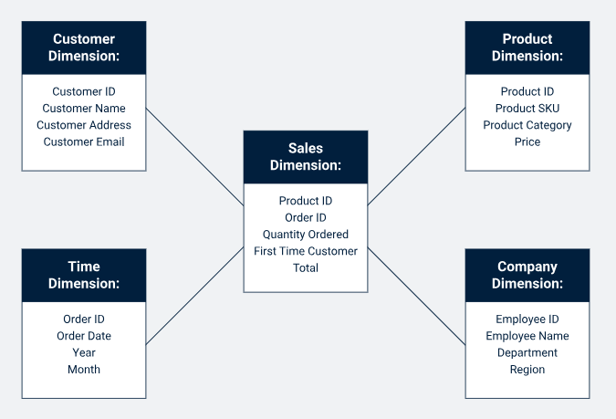
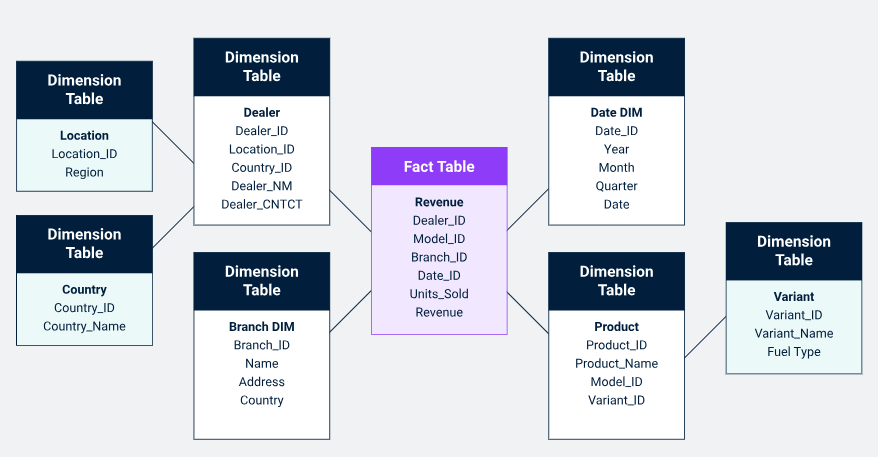
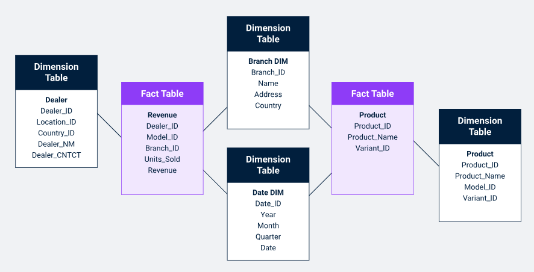

# Data Warehousing

A data warehouse is a centralized repository that stores large amounts of structured data from various sources, designed to support business intelligence activities such as reporting, analytics, and data mining. 
It typically consolidates data from different operational systems, cleanses and organizes it for efficient querying and analysis. Data warehouses are used to enable faster 
and more accurate decision-making by providing a historical view of data and facilitating complex queries without disrupting day-to-day business operations. 
They are crucial for companies to gain insights and make data-driven decisions.

## Online Transactional Processing (OLTP)
**Definition**: The original source of truth data.

**Example**: Let's say that we're building a service with transactional information Casandra DB. Why Cassandra? Because CAP Theorem.

**Requirements**:
* highly available
* highly normalized
* with quick read/write transactions
* Good for random access rather than scans.
* Frequent backups
* Very redundant
Historical data for this service can be archived somewhere so long as the end-user doesn't need it.
Needless to say, don't let data analysts/PMs do a "SELECT *" query on this DB directly.

## Online Analytical Processing (OLAP)
**Definition**: The compiled source of reporting data.

**Example**: So we take our Cassandra-based service & throw it to another DB. We also take a few logs that service spits out, process it, and throw it into another table. Now I tell my DS/DAs to not touch the production Cassandra DB, and use this instead. Why not Cassandra? Because of the 'A' in CAP theorem isn't a strong constraint. 

**Requirements**:
* Good at large scans
* Can readily store vasts amount of data (reading from Data Lakes w/schema-on-read is common here)
* Good for complex queries
* highly denormalized (STAR/SNOWFLAKE)
* No need for high availability
* No need for backups if we can just reload data from original sources of truth
* If it goes down, it won't impact customers; just internal team

## Data Mart
Definition: A datamart is a subset of a datawarehouse that is dedicated to just 1 subject. Good for permissioning & isolation & individual use-cases.

Types
* **Dependent DataMart**: OLTP -> Data Warehouse -> Data Mart. IMO this is the way 2 go for scalability concerns.
* **Independent DataMart**: OLTP -> Data Mart. Good only for small use-cases where you need quick results
* **Hybrid DataMart**: OLTP -> Data Mart <- Data Warehouse. Only good if multiple datamarts will never need OLTP information.

## Table Structure
### Facts & Dimension Tables
**Definition**: Fact tables contain the truth with no adjectives. 
**Example** this surgery happened. It is the core event that can be described with dimensions.
**Example** This sale took place with this product id and date id.

**Definition**: Dimension tables contain the adjectives of the fact. A subject has dimensions, and a dimension has attributes.
**Example** this surgery happened with this procedure is the fact. Date, Day of Week, Month are all **attributes** of the date dimenion. The the procedure name, complexity, average completion time, in/outpatient is a procedure dimension. We also have Provider dimension. Block Dimension.

### What is Grain?
**Definition**:  A grain is the depth of data. A fact table is usually at a low granualirty.
**Example**: Each row of a surgery fact table represents a surgery that occurred. This allows us to ask rich questions. "What are the most common surgeries today? Which room is the most active today? etc"

### Types of Fact Tables:

**Types of Facts**
* **Additive**: Measures should be added to all dimensions. (Surgery Date)
* **Semi-Additive**: Measures may be added to some dimensions and not with others. (primary procedure in a surgery)
* **Non-Additive**: SIt stores some basic unit of measurement of a business process. (cut-to-close timestamps)

**Factless Table**: This is a table that doesn't have an aggregate number. Just a business event.

### Types of Dimensions:
**Conformed Dimensions** - Shared across many fact tables

**Slowly changing dimensions** - A dimension that slowly changes over time
    * SCD 0 - Ignore
    * SCD 1 - Update/UPSERT (i.e: Name or surgery date)
    * SCD 2 - Insert a new record into a dimension table (i.e: OR room, case status)
    * SCD 3 - Add new column. For before + after changes in a single record.

## Common Schemas
Star Schema, Snowflake Schema, and Galaxy Schema are not that different. In reality, your warehouse is probably a galaxy schema that, depending on the question you get, you may draw out a diagram that looks like a snowflake/galaxy schema.

### Star Schema

**Definition**: A star schema is a fact table with FK references onto one level of dimension tables.

Visually it looks like a star with fact table in centeral and dimension tables around it. Very easily understood.

**Example**: Procedures is the fact table. Links out to proceduretype, serviceline, procedures, provider dimensions

### Snowflake schema

**Definition**: A snowflake schema is like a star schema, except dimensions have dimensions. The fact table is thus connected onto 2 levels of dimension tables.

Visually it looks like a snowflake because fact able is in the center, and dimensions spiral outward.

**Example**: Procedures is the fact table. Links out to procedure-surgeons. Suregons split out to another dimension listing all the surgeons.

### Fact Constellation / Galaxy Schema

**Definition**: Multiple fact tables have correlation to shared dimensions, which could possibly snowflake out.

Note: Shared dimensions between fact tables are call conformed dimensions. Most data warehouses will have this setup.

**Example**: Procedures is a fact. Blocks are a fact. Operating Room dimension & date dimensions are "conformed dimensions" because they are shared within both. This means that procedures and blocks can be correlated through these conformed dimensions.

### Design
**Tips** Use Dimensional Modeling. Use denormalization.
0. Start with knowledge of consumers. Each one will be their own data mart.
1. Conceptual Model
* Start with event.
* Then determine grain.
* Then dimensions. Conjoined or SCD. Identify OLAP Cubes.
2. Logical Model.
* Add properties.
* PKs. FKs.
* Design for Conjoined or slowly changing dimensions.
* Design for OLAP cube operations.
3. Physical models
* Write it all out.
4. Create a meta table for all ETL/ELT