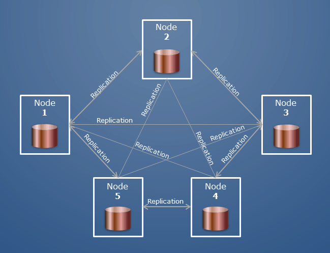
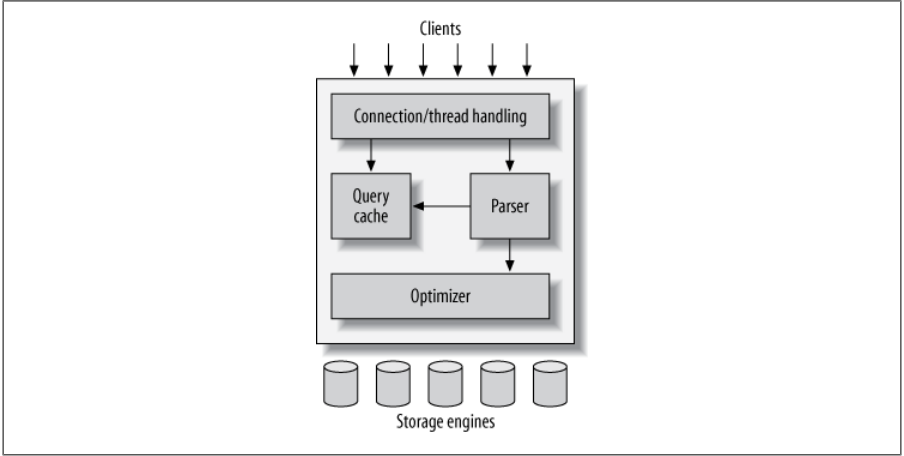

<details><summary>Learning Objectives</summary>
<br>

After completing this module, associates should be able to:
- Describe an RDBMS
- Identifiy the benefits of using an RDBMS
- Describe the basic components of an RDBMS

</details>
<details><summary>Description</summary>
<br>

Relational Database Management System or RDBMS is a set of software and capabilities that enable IT teams to create, update, administer and interact with a relational database. An RDBMS is a database management systems (DBMS) based on a relational model as defined by E.F. Codd in 1970.

The use of RDBMS is essential in large scale application development. The use is so widespread that it would be nearly impossible to find an enterprise application that doesn't utilize an RDBMS for data persistence. Below is a list of some reasons for using an RDBMS.

- Structured data model
- Large scale concurrent data access
- Fault tolerance
- Distributed data storage
- Enforced data integrity
- Support for multiple client types

</details>
<details><summary>Real World Application</summary>
<br>

Databases provide the backbone of data persistence in enterprise applications. Large business applications are designed around the idea of scalability which emphasizes stateless execution. This means that a single application in the system won't store its own data locally, but use some other type of data persistence. RDBMS is a solution for this problem.

## Choosing persistence

System architects and project teams work to identify what type of persistence an application will need and incorporate it into the design of the system. RDBMS is just one solution, and there is a host of vendors to choose from. So how does one choose an RDBMS persistence provider. The following list is just a few features to consider.

- Distribution type
- Scalability
- License types
- Security features
- Support

### Distribution type

Installing the database is half the battle and of course there are a number of different ways to distribute the database software.

| Distro Type | Description                                                                        |
| ----------- | ---------------------------------------------------------------------------------- |
| Standalone  | Individually downloaded and installed software built for specific OS architectures |
| Managed     | Cloud-based installations like AWS RDS and GCP CloudSQL                            |
| Containers  | Container images like Docker                                                       |

Each distribution type has its pro and cons, which out of the scope of this document, but each should be considered before choosing which distribution type works best for the solution.

## Scalability

Much like the applications that use databases for persistence, the databases themselves should be scalable. The problem is, databases can't be stateless. The scalability of a database is centered around clustering. Clustering is a scheme where multiple nodes are orchestrated to behave as a single unit. In RDBMS clustering however, there is a slight difference. An RDBMS cluster is constructed with a single master and multiple other replicas. This means all reads and writes happen primarily on the master with data being propagated to the replicas over time.



Most vendors implement some kind of clustering capabilities into their databases, so the biggest decision on clustering is, how much work do you want to do. The distribution type will play a big part in this with `Standalone` distributions requiring the most effort, `Managed` distributions requiring the least effort, and `Container` distributions somewhere in between.

## License type

Each vendor will have different license types. MySQL is free and so is PostgresSQL, but not all RDBMS systems are free. The project budget will dictate this decision. Feature sets are also often tied to license type so this will also help dictate this decision.

## Security features

Security is paramount to data. One should consider security trade-offs when deciding to use any software tool. These features could also be tied to license type.

## Support

A good support structure is essential for software especially for software not built by your team or company. It is good to have some way to get help when issues may arise. Support can come from different sources.

- Documentation
- Community forums
- Email/Chat
- Call center
- Technician/Specialist

Many times the level of available support is based on license type.

</details>
<details><summary>Implementation</summary> 
<br>

The implementation of an RDBMS is strictly dependent on the RDBMS vendor. Typically the implementation of the RDBMS is based on the SQL standard and there are many different RDBMS vendors. Below is a non-exhaustive list of popular RDBMS vendors.

- Oracle
- MySQL
- PostgreSQL
- SQL Server
- MariaDB
- SQLite

Since the implementation of the system is dependent on the RDBMS vendor, the architecture can vary drastically. Below is a simple breakdown of the MySQL architecture.



The architecture can be broken down into 6 parts.

| Component          | Purpose                                                                                                                                             |
| ------------------ | --------------------------------------------------------------------------------------------------------------------------------------------------- |
| Client             | Provides users the ability to connect to database servers and execute commands.                                                                     |
| Connection Handler | Receives incoming client connections and create new thread execution contexts for isolating client connections from each other.                     |
| Parser             | Validate and convert SQL commands to system commands.                                                                                               |
| Query Cache        | Store query results for later retrival when the same commands are executed.                                                                         |
| Optimizer          | Apply available engine optimizations to execute queries in the most optimal way to reduce query execution time and ensure properly execution order. |
| Storage Engine     | Stores data on hard drives for persistent access.                                                                                                   |

It is important to note that this diagram is not comprehensive and is not an accurate representation of all implementations of SQL based RDBMS, but does illustrate some important parts of the system. To understand the particular architecture of the DB vendor you are using, additional research will be needed.

## Data structure

The discussion of vendor choice and vendor implementation aside an RDBMS is a DBMS based on relationships, all RDBMS implementations are based on some simple relation concepts.

An RDBMS manages data by storing them in tables. A single relational database can contain many tables along with many other types of objects. RDBMS serves as the basis for Structured Query Language (SQL) which is used to perform the various management operations on the system.

### What is a table

One of the core components of an RDBMS is an object called a `table`. Data in the RDBMS is store in `tables`. A `table` consists of related data entries called `rows` or `records` and each `row` consist of numerous `columns` or `fields`. A `column` is defined by a number of `constraints`.

Let's look at an example table called 'Employees'.

```
+----+-----------+----------+------------+-----------+
| id | firstName | lastName | department | reportsTo |
+----+-----------+----------+------------+-----------+
|  1 | Jimmy     | Johnson  |          1 |      NULL |
|  2 | Aaron     | Anderson |          1 |         1 |
|  3 | Emily     | Emerson  |          1 |         1 |
+----+-----------+----------+------------+-----------+
```

### What is a Row

A `row` is an individual entry that exists in a table. The terms `row` and `record` can be used interchangably. In the 'Employees' table there are 3 rows. Below is a single row.

```
+----+-----------+----------+------------+-----------+
|  1 | Jimmy     | Johnson  |          1 |      NULL |
+----+-----------+----------+------------+-----------+
```

### What is a Column

A `column` is the smallest entity of a table. A single column makes up a single data point on a row. The 'Employees' table has 5 columns:

```
+----+-----------+----------+------------+-----------+
| id | firstName | lastName | department | reportsTo |
+----+-----------+----------+------------+-----------+
```

### What is a constraint

A `constraint` is some restriction on the type or value that can be assigned to a `column`. In the 'Employee' table, each of the 5 columns has set of constraints on them, for instance the 'firstName' column has a `constraint` of `not null` which means this `column` must always have a value and can never be null.

<hr/>

## Exercise (Optional)

Discuss: Why do you think the `department` and `reportsTo` columns have number values rather than some other meaningful values?

Discuss: What is the intended purpose of the `id` column?

</details>
<details><summary>Summary</summary> 
<br>

An RDBMS is a data storage system based on a relational model where data that is related to a particular object is stored in `tables` with each entry being represented as a `row` and each data point is a `column` in the row that is validated by a set of `constraints`. The most common type of RDBMS is based on a standard called SQL, however there are many different implementations (vendors) of the standard each providing a unique set of benefits and features.

</details>
<details><summary>Practice Questions</summary>

[Practice Questions](./Quiz.gift)</details>
