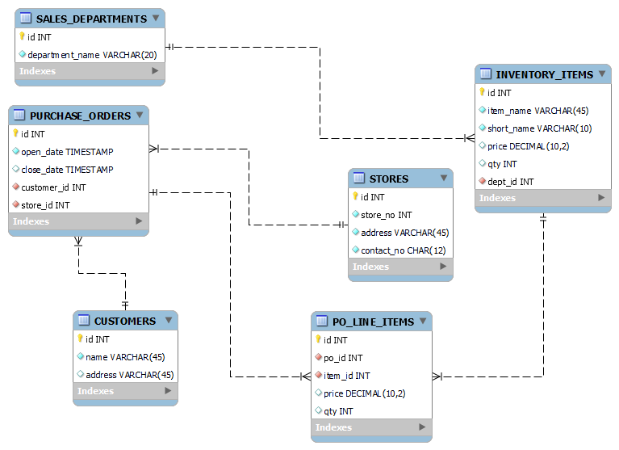

<details><summary>Learning Objectives</summary>
<br>

After completing this module, associates should be able to:
- Describe the purpose of schema in a database

</details>
<details><summary>Description</summary>
<br>

The term `schema` comes from Greek and is defined as 'form, figure'. In the world of databases, `schema` gives shape to the data stored in the database. In a DBMS, schema is the structure of a database which is described in a formal language which is supported by the DBMS. In layman's terms, schema refers to the organization of data as a blueprint for the construction of the database. In an RDBMS the schema of the particular data items are divided into tables.

Database schema is declared using a formal language, for RDBMS the language is SQL, the schema is structured using integrity constraints to ensure compatibility between the different parts of the schema. In enterprise application development, the definition of a schema is centered on modeling the data for a particular set of problems. The solutions will be implemented in software, but the data is stored in a database schema separate from the application of software logic.

</details>
<details><summary>Real World Application</summary>
<br>

The real world application of `schema` comes in two steps: modeling then implementation. Modeling can be done using tools to create an Entity Relation Diagram (ERD), then implementation uses SQL to create the table objects.

Let's look at a schema for an inventory management system.


This schema defines a number of table objects and there relationships. There is a large amount of information here that defines the schema. This information is called the integrity constraints. Integrity constraints include:

- Column names
- Data types
- Data constraints
- Relationships

With the design done, let's view the script to create this schema.

```SQL
-- MySQL Script generated by MySQL Workbench
-- Thu Jun 16 15:19:40 2022
-- Model: New Model    Version: 1.0
-- MySQL Workbench Forward Engineering

SET @OLD_UNIQUE_CHECKS=@@UNIQUE_CHECKS, UNIQUE_CHECKS=0;
SET @OLD_FOREIGN_KEY_CHECKS=@@FOREIGN_KEY_CHECKS, FOREIGN_KEY_CHECKS=0;
SET @OLD_SQL_MODE=@@SQL_MODE, SQL_MODE='ONLY_FULL_GROUP_BY,STRICT_TRANS_TABLES,NO_ZERO_IN_DATE,NO_ZERO_DATE,ERROR_FOR_DIVISION_BY_ZERO,NO_ENGINE_SUBSTITUTION';

-- -----------------------------------------------------
-- Schema mydb
-- -----------------------------------------------------
-- -----------------------------------------------------
-- Schema inventory
-- -----------------------------------------------------

-- -----------------------------------------------------
-- Schema inventory
-- -----------------------------------------------------
CREATE SCHEMA IF NOT EXISTS `inventory` DEFAULT CHARACTER SET utf8mb4 COLLATE utf8mb4_0900_ai_ci ;
USE `inventory` ;

-- -----------------------------------------------------
-- Table `inventory`.`SALES_DEPARTMENTS`
-- -----------------------------------------------------
CREATE TABLE IF NOT EXISTS `inventory`.`SALES_DEPARTMENTS` (
  `id` INT NOT NULL AUTO_INCREMENT,
  `department_name` VARCHAR(20) NOT NULL,
  PRIMARY KEY (`id`),
  UNIQUE INDEX `department_name_UNIQUE` (`department_name` ASC) VISIBLE)
ENGINE = InnoDB;


-- -----------------------------------------------------
-- Table `inventory`.`INVENTORY_ITEMS`
-- -----------------------------------------------------
CREATE TABLE IF NOT EXISTS `inventory`.`INVENTORY_ITEMS` (
  `id` INT NOT NULL AUTO_INCREMENT,
  `item_name` VARCHAR(45) NOT NULL,
  `short_name` VARCHAR(10) NOT NULL,
  `price` DECIMAL(10,2) UNSIGNED NULL DEFAULT 0.99,
  `qty` INT NULL DEFAULT 0,
  `dept_id` INT NOT NULL,
  PRIMARY KEY (`id`),
  UNIQUE INDEX `short_name_UNIQUE` (`short_name` ASC) VISIBLE,
  INDEX `fk_item_dept_idx` (`dept_id` ASC) VISIBLE,
  CONSTRAINT `fk_item_dept`
    FOREIGN KEY (`dept_id`)
    REFERENCES `inventory`.`SALES_DEPARTMENTS` (`id`)
    ON DELETE NO ACTION
    ON UPDATE NO ACTION)
ENGINE = InnoDB;


-- -----------------------------------------------------
-- Table `inventory`.`STORES`
-- -----------------------------------------------------
CREATE TABLE IF NOT EXISTS `inventory`.`STORES` (
  `id` INT NOT NULL AUTO_INCREMENT,
  `store_no` INT UNSIGNED NOT NULL,
  `address` VARCHAR(45) NOT NULL,
  `contact_no` CHAR(12) NOT NULL,
  PRIMARY KEY (`id`),
  UNIQUE INDEX `address_UNIQUE` (`address` ASC) VISIBLE)
ENGINE = InnoDB;


-- -----------------------------------------------------
-- Table `inventory`.`CUSTOMERS`
-- -----------------------------------------------------
CREATE TABLE IF NOT EXISTS `inventory`.`CUSTOMERS` (
  `id` INT NOT NULL AUTO_INCREMENT,
  `name` VARCHAR(45) NOT NULL,
  `address` VARCHAR(45) NULL,
  PRIMARY KEY (`id`))
ENGINE = InnoDB;


-- -----------------------------------------------------
-- Table `inventory`.`PURCHASE_ORDERS`
-- -----------------------------------------------------
CREATE TABLE IF NOT EXISTS `inventory`.`PURCHASE_ORDERS` (
  `id` INT NOT NULL AUTO_INCREMENT,
  `open_date` TIMESTAMP NOT NULL,
  `close_date` TIMESTAMP NULL,
  `customer_id` INT NOT NULL,
  `store_id` INT NOT NULL,
  PRIMARY KEY (`id`),
  INDEX `fk_po_store_idx` (`store_id` ASC) VISIBLE,
  INDEX `fk_po_customer_idx` (`customer_id` ASC) VISIBLE,
  CONSTRAINT `fk_po_store`
    FOREIGN KEY (`store_id`)
    REFERENCES `inventory`.`STORES` (`id`)
    ON DELETE NO ACTION
    ON UPDATE NO ACTION,
  CONSTRAINT `fk_po_customer`
    FOREIGN KEY (`customer_id`)
    REFERENCES `inventory`.`CUSTOMERS` (`id`)
    ON DELETE NO ACTION
    ON UPDATE NO ACTION)
ENGINE = InnoDB;


-- -----------------------------------------------------
-- Table `inventory`.`PO_LINE_ITEMS`
-- -----------------------------------------------------
CREATE TABLE IF NOT EXISTS `inventory`.`PO_LINE_ITEMS` (
  `id` INT NOT NULL AUTO_INCREMENT,
  `po_id` INT NOT NULL,
  `item_id` INT NOT NULL,
  `price` DECIMAL(10,2) NULL DEFAULT 0.99,
  `qty` INT NULL DEFAULT 1,
  PRIMARY KEY (`id`),
  INDEX `fk_po_item_idx` (`po_id` ASC) VISIBLE,
  INDEX `fk_item_line_itm_idx` (`item_id` ASC) VISIBLE,
  CONSTRAINT `fk_po_line_itm`
    FOREIGN KEY (`po_id`)
    REFERENCES `inventory`.`PURCHASE_ORDERS` (`id`)
    ON DELETE NO ACTION
    ON UPDATE NO ACTION,
  CONSTRAINT `fk_item_line_itm`
    FOREIGN KEY (`item_id`)
    REFERENCES `inventory`.`INVENTORY_ITEMS` (`id`)
    ON DELETE NO ACTION
    ON UPDATE NO ACTION)
ENGINE = InnoDB;


SET SQL_MODE=@OLD_SQL_MODE;
SET FOREIGN_KEY_CHECKS=@OLD_FOREIGN_KEY_CHECKS;
SET UNIQUE_CHECKS=@OLD_UNIQUE_CHECKS;
```

There is a lot of SQL script here. This script was generated by MySQL Workbench Forward Engineering Tool. It inserts a lot of database specific code which can be omitted, but we can look at the create statements and observe the use of integrity constraints.

</details>
<details><summary>Implementation</summary> 
<br>

The focus of this section is `schema`, however it is impossible to implement schema in an RDBMS without the use of SQL. The way to implement a schema is to first create it, this step is dependent on the database vendor. Generally the syntax is:

```SQL
create schema <schema_name>;
```

After the schema has been created the data is divided in tables.

```SQL
create table <table_name> (
    <col_name> datatype constraint1 constraint2 ...,
    ...
);
```

A full schema is created using multiple create statements that define each table and those table relationships.

</details>
<details><summary>Summary</summary> 
<br>

A database schema defines the form of database and the data within it. An RDBMS schema can include objects like tables, triggers, functions, procedures, indexes, and views. In this section we focused on tables. In RDBMS table the schema defines the columns, their data types, and constraints.

</details>
<details><summary>Practice Questions</summary>

[Practice Questions](./Quiz.gift)</details>
