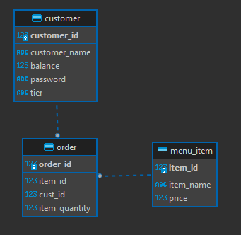

Learning Objectives

 

After completing this module, associates should be able to:
- Define Data Modeling
- Interpret an Entity Relationship Diagram (ERD)
- Generate an ERD 

Description

## Data Modeling

Data modeling is a conceptual representation of the data objects, data object relationships, and data object rules. It is used to help save costs, improve documentation, reduce time to market, and establish consistent data.

Data modeling is not strictly limited to the relational databases, but can include a variety of data models such as:

    - JSON Data Model
    - Key-Value Data Model
    - Graph Data Model
    - Wide-Column Data Model

These examples of data models are good to know of and feel free to research on them, but for the purpose of the SQL unit, we focus on the relational data model.

## Entity Relationship Diagram (ERD)

Entity Relationship Diagram is a graphical representation depicting the relationships among data objects within a database. These entities, such as people, objects or concepts relate to one another within the database. Also known as ER Models, these define a set of symbols such as rectangles, diamonds and connecting lines to depict the entities relationship and their attributes. Seen in the example below:

Each table is title with a name representing the entity. At the top of each table there is a key symbol depicting our primary key, red diamonds for foreign keys and all others denoting the remaining entity attributes.

Real World Application

## Data Modeling

Data modeling is used in practice for evaluating the data objects and their relationships to other entities used to investigate the business' data requirements for processes.

For example, let's think about a driver's license. We can use data modeling to determine if we have enough available combinations for our unique identifiers. When generating ID identifiers, we need to make sure the data type and constraints we've established are enough to handle our needs, accounting for the growth of the population. Prior to implementation, we can establish the rules for our data, saving us time, money and headache in the future.

## Entity Relationship Diagram

Entity Relationship diagrams allows us to visualize the entities, their attributes and relationships to one another. This can be done via third party software such as Microsoft Visio or LucidChart, but inside of most database IDEs is some form of basic ERD generation tool. As you have seen previously, the image below is the example of an ERD generated through an IDE (DBeaver):

We can see symbols at the end of relationship lines that link the entities. These symbols indicate how many instances of one entity are related to how many instances of another entity. In Crow's Foot notation, there are usually two symbols beside one another. For the first symbol, it can be a crows foot which indicates many instances, or it can be a single line which represents a single instance. For the second symbol, it can be either a single line to indiciate it is mandatory or a circle which represents that it is optional (there can be zero instances). Note that other notations use different symbols.

Using the above ERD for a commerce database, you can see how stores, customer, department and sales information is all intertwined.

Implementation
 
 

Data Modeling and ERDs can be generated through third party softwares such as Microsoft Visio, LucidChart and a variety of other web based diagram tools. For our purpose we can simply make ERDs with our database IDE (DBeaver). While in DBeaver to generate an ERD of your database simply follow these steps:

1. Select your database and expand in the Database Navigator Menu on left-hand side.
2. Expand your Databases inside of your database
3. Expand the name of your database
4. Expand the Schemas directory
5. Right-click on the schema you wish to generate an ERD, select View Diagram.
6. DBeaver, will open a new tab in the editor with an extremely basic version of an ERD for your tables. See below:

Summary
 
 

Data modeling is a process for developing the data model for storing information within a database, used in practice for evaluating the data objects and their relationships to other entities used to investigate the business' data requirements for processes
- Relation Data Model is only one of a few different types, but the one we focus on for SQL

Entity Relationship Diagram (ERD) is a graphical representation depicting the relationships among data objects within a database for entities with relationships such as people, objects or concepts.
- ERD can be generated with third party applications
- Simple ERD can be generated through your database IDE

Practice Questions

[Practice Questions](./Quiz.gift)

