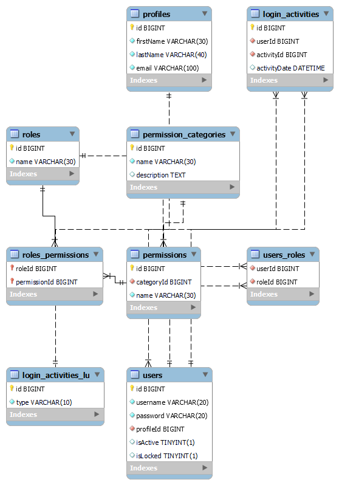
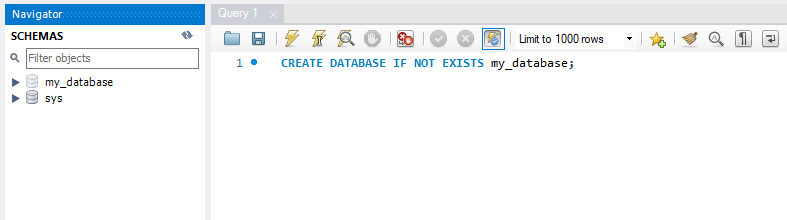
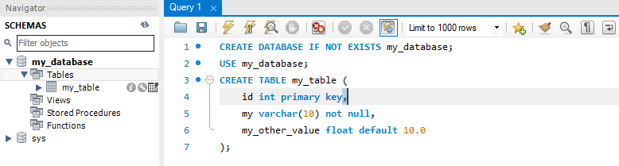
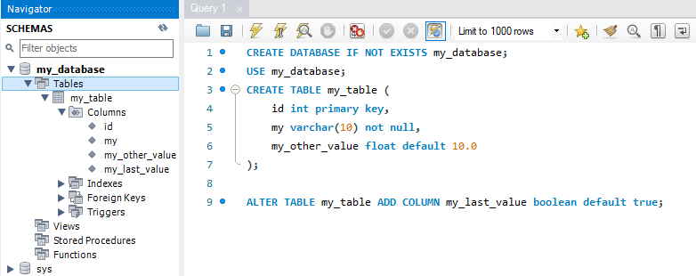

<details><summary>Learning Objectives</summary>

<br>

After completing this module, associates should be able to:

- Describe the DDL sublanguage
- Identify the command set of DDL
- Execute DDL statements on a RDBMS

</details>
<details><summary>Description</summary>
<br>

Data Definition Language is the SQL language subset used for defining data or altering structure in the database.

In order to utilize the functions of the DDL sublanguage, a database user must have the appropriate permissons on the server and on the particular parent object. For instance, to create a table on a database, the user must have the permission to create the table on the database object. That same user may not have any other permissions on the same parent object.

### Commands

- CREATE
- DROP
- ALTER
- RENAME
- TRUNCATE
- COMMENT

### Create

The `CREATE` command is used to create objects on the server. `CREATE` can be used to create:

- Database
- User
- Table
- Index
- Trigger
- Function
- Stored Procedure
- View

### Drop

The `DROP` command is used to remove objects from the server. Any object created using the `CREATE` command can be dropped using the `DROP` command.

### Alter

The `ALTER` command is used to change some characteristics of an object. The command will ultimately be used to add, drop, or modify some option on the object.

The `ALTER` command is commonly used to change table characteristics, like:

- Add/Drop columns
- Add/Drop constraints
- Modify column data types
- Modify column constraints

### Rename

The `RENAME` command is used to rename objects.<br>
NOTE: The availability and syntax of the `RENAME` command for database objects vary between database management systems (DBMS). Consult the specific DBMS documentation to ensure accurate command usage 

### Truncate

The `TRUNCATE` command is used to remove all data from a table along with all space allocated for the records. Unlike `DROP` truncate will preserve the structure of the table.

### Comment
The `COMMENT` command is typically used to add comments or descriptions to database objects like tables, columns, or views. This information is not used by the database itself but can be helpful for documentation purposes or for providing additional information about the structure of the database.
You could also write comments in SQL by useing single line `--` and multi-line `/*  */` comments.

</details>
<details><summary>Real World Application</summary>
<br>

The DDL sublanguage is used to define the structure of the database that will model the data which is used to persist application state. The main commands behind DDL are `CREATE`, `DROP`, `ALTER`, `TRUNCATE`, `RENAME`, `COMMENT`. The combination of these commands are used to maintain the structure of the database designed to support application functionality.

Database administrators use the DDL sublanguage to define complex tables and the relationships between them, the constraints on the data in the table, search indexs, large table partitions, and so on. Let's envision a complex system for user-identity management. Some of the concepts here go beyond the atomic concept of DDL and creating or maintaining structure. Focus on just the DDL specific tasks.



The script required to create this ERD is a combination of the `CREATE` and `ALTER` commands.

```SQL
CREATE DATABASE IF NOT EXISTS IAM;

USE IAM;

CREATE TABLE IF NOT EXISTS permission_categories (
	id BIGINT PRIMARY KEY,
    name VARCHAR(30) NOT NULL UNIQUE,
    description text(255)
);

CREATE TABLE IF NOT EXISTS permissions (
	id BIGINT PRIMARY KEY,
    categoryId BIGINT NOT NULL,
    name VARCHAR(30) NOT NULL UNIQUE,
    index(categoryId, name)
);

CREATE TABLE IF NOT EXISTS roles (
	id BIGINT PRIMARY KEY,
    name VARCHAR(30) NOT NULL UNIQUE
);

CREATE TABLE IF NOT EXISTS roles_permissions(
	roleId BIGINT,
    permissionId BIGINT,
    PRIMARY KEY(roleId, permissionId)
);

CREATE TABLE  IF NOT EXISTS login_activities_lu (
	id BIGINT PRIMARY KEY,
    type VARCHAR(10) NOT NULL UNIQUE
);

CREATE TABLE IF NOT EXISTS profiles (
	id BIGINT PRIMARY KEY,
    firstName VARCHAR(30) NOT NULL,
    lastName VARCHAR(40) NOT NULL,
    email VARCHAR(100) NOT NULL UNIQUE
);

CREATE TABLE IF NOT EXISTS users (
	id BIGINT PRIMARY KEY,
    username VARCHAR(20) NOT NULL UNIQUE,
    password VARCHAR(20) NOT NULL,
    profileId BIGINT NOT NULL,
    isActive BOOLEAN DEFAULT true,
    isLocked BOOLEAN DEFAULT false
);

CREATE TABLE IF NOT EXISTS login_activities (
	id BIGINT PRIMARY KEY,
    userId BIGINT NOT NULL,
    activityId BIGINT NOT NULL,
    activityDate DATETIME DEFAULT NOW()
);

CREATE TABLE IF NOT EXISTS users_roles (
	userId BIGINT NOT NULL,
    roleId BIGINT NOT NULL
);

ALTER TABLE permissions ADD CONSTRAINT fk_permissions_category_id FOREIGN KEY(categoryId) REFERENCES permission_categories(id);
ALTER TABLE roles_permissions ADD CONSTRAINT fk_permissions_role_id FOREIGN KEY(roleId) REFERENCES roles(id);
ALTER TABLE roles_permissions ADD CONSTRAINT fk_roles_permission_id FOREIGN KEY(permissionId) REFERENCES permissions(id);
ALTER TABLE users ADD CONSTRAINT fk_users_profile_id FOREIGN KEY(profileId) REFERENCES profiles(id);
ALTER TABLE login_activities ADD CONSTRAINT fk_login_user_id FOREIGN KEY(userId) REFERENCES users(id);
ALTER TABLE login_activities ADD CONSTRAINT fk_login_activity_id FOREIGN KEY(activityId) REFERENCES login_activities_lu(id);
ALTER TABLE users_roles ADD CONSTRAINT fk_ur_user_id FOREIGN KEY(userId) REFERENCES users(id);
ALTER TABLE users_roles ADD CONSTRAINT fk_ur_role_id FOREIGN KEY(roleId) REFERENCES roles(id);
```

Once the schema is created using DDL, the responsibility for maintaining the schema falls upon the database administrator to continuously manage the structure in response to changing requirements. The need to add new tables, remove tables, add constraints or columns could present themselves on a daily basis as teams coordinate their needs for persistent data structure.

</details>
<details><summary>Implementation</summary> 

### Create

Let's start out by creating a new database. The syntax for creating a database is,

```sql
CREATE {DATABASE | SCHEMA} [IF NOT EXISTS] db_name;
```

Let's create a database named `my_database`

```SQL
CREATE DATABASE IF NOT EXISTS my_database;
```

The results:



**NOTE: it may be required to refresh your IDE view to see the results**

The same `CREATE` command can be used to create a table in the newly created database, with slight change to the syntax.

```SQL
CREATE [TEMPORARY] TABLE [IF NOT EXISTS] table_name (create_definition, ...) [table_options] [partition_options]
```

Focus on the create command and the `(create_definition)`. The create_definition section of the statement can be summed up as the definition of the columns in the table. Generally in this format.

```SQL
(
    col_name data_type constraints,
    ...
)
```

Let's now create a table call `my_table`

```sql
USE my_database;
CREATE TABLE my_table (
	id INT PRIMARY KEY,
    my VARCHAR(10) NOT NULL,
    my_other_value FLOAT DEFAULT 10.0
);
```

The results:



**NOTE: In MySQL it is necessary to select a database to which to apply statements. You should execute the `USE db_name` statement before the create statement**

Now that the database has some structure, let's use the `ALTER` command to change the structure of the table. The syntax.

```SQL
ALTER TABLE table_name [alter_option, [alter_option], ...] [partition_options]
```

**NOTE: The `ALTER` command has a lot of different options depending on what and how you want to change the table.**

Let's alter the table by adding a column using the syntax:

```SQL
ALTER TABLE table_name ADD COLUMN col_name col_definition
```

```SQL
ALTER TABLE my_table ADD COLUMN my_last_value boolean default true;
```

The results:



At this point the database has a working structure. Following is the syntax of the remaining commands which are trivial in comparison.

```SQL
DROP [TABLE] table_name
```

### Rename

```SQL
RENAME TABLE old_name TO new_name [, old2_name TO new2_name] ...
```

### Truncate

```SQL
TRUNCATE [TABLE] table_name
```

<hr/>

## Exercise (Optional)

- Create a database named `library`
- In the `library` database create a table name `books`
  - column: id INT PRIMARY KEY
  - column: title VARCHAR(100) NOT NULL
  - column: author VARCHAR(50) NOT NULL
- Alter the `books`
  - Add column: publication_date not null timestamp
  - Add constraint: title unique

</details>
<details><summary>Summary</summary> 
<br>

The DDL sublanguage of SQL is utilized to create and manage the structure of a database. DDL consist of the commands `CREATE`, `DROP`, `ALTER`, `TRUNCATE`, and `RENAME`. Using DDL the overall structure is modeled by creating objects like tables where the specific columns, data types, constraints, and relationships are defined.

</details>
<details><summary>Practice Questions</summary>

[Practice Questions](./Quiz.gift)</details>
