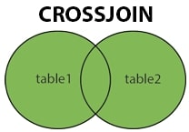

<details><summary>Learning Objectives</summary>

<br>

After completing this module, associates should be able to:
- Describe what a `CROSS JOIN` is
- Write commands that make use of `CROSS JOIN`

</details>
<details><summary>Description</summary>
<br>

- `CROSS JOIN`, commonly known as a `CARTESIAN JOIN`, returns all possible row combinations from each table.
- If no condition is provided, the result set is obtained by multiplying each row of table1 with all rows in table2.



**Syntax**:  
SELECT *  
FROM Table1  
CROSS JOIN Table2;  
</details>
<details><summary>Real World Application</summary>
<br>

* `CROSS JOIN` is used when we need to find all the possibilites of combining multiple records where the result set includes every row from each contributing table.
* Creating Test Data - `CROSS JOIN` can be used to generate a Cartesian product, providing a comprehensive dataset for testing.
* Finding Missing Relationships - `CROSS JOIN` can be employed to identify missing relationships or gaps in data. 

</details>
<details><summary>Implementation</summary> 
<br>

Let's consider a real-world example involving an online store. Below, we have the two tables `Customers` and `Products`:

Table: Customers

|customerid|f_name |l_name   |
----------|-------|---------|
|1|Alice  |May      |
|2|Bob    |Parker   |
|3|Charlie|Chocolate|

Table: Products

|productid|productname|price |
---------|-----------|------|
|101|Laptop     |999.99|
|102|Smartphone |499.99|
|103|Headphones | 79.99|

Let's generate all possible combinations of customers and products using a cross join.

```sql
-- Cross join to generate all combinations of customers and products
SELECT Customers.CustomerID, Customers.F_Name, Customers.L_Name, 
Products.ProductID, Products.ProductName, Products.Price AS ProductPrice
FROM Customers
CROSS JOIN Products;
```

In this example, the `Customers` table represents the store's customers, and the Products table represents the available products with their prices. The cross join generates all possible combinations of customers and products, allowing you to see every customer paired with every product.

**OUTPUT**:

|customerid|f_name |l_name   |productid|productname|productprice|
----------|-------|---------|---------|-----------|------------|
|1|Alice  |May      |      101|Laptop     |      999.99|
|2|Bob    |Parker   |      101|Laptop     |      999.99|
|3|Charlie|Chocolate|      101|Laptop     |      999.99|
|1|Alice  |May      |      102|Smartphone |      499.99|
|2|Bob    |Parker   |      102|Smartphone |      499.99|
|3|Charlie|Chocolate|      102|Smartphone |      499.99|
|1|Alice  |May      |      103|Headphones |       79.99|
|2|Bob    |Parker   |      103|Headphones |       79.99|
|3|Charlie|Chocolate|      103|Headphones |       79.99|


This information can be useful because now we can analyzing potential sales opportunities, understand customer preferences, or generating comprehensive reports for marketing strategies.

</details>
<details><summary>Summary</summary> 
<br>

* `CROSS JOIN` can potentially result in a very large output.
* In a `CROSS JOIN`, there is no ON clause specifying a matching condition because it explicitly generates all possible combinations of rows from the involved tables.

</details>
<details><summary>Practice Questions</summary>

[Practice Questions](./Quiz.gift)</details>
