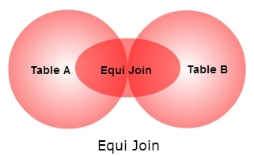

<details><summary>Learning Objectives</summary>
<br>

After completing this module, associates should be able to:

- Describe the use of `EQUI JOIN` and `THETA JOIN` in a database
- `EQUI JOIN` vs `THETA JOIN`

</details>
<details><summary>Description</summary>
<br>

* `THETA JOIN` allows us to merge two tables based on an arbitrary condition, and is represented by the symbol theta (Θ or θ).
  * In other words, a `THETA JOIN` is a join in which some arbitrary comparison relationship is used. For example (”>”, “<”, “>=”, etc...)
  * For a `THETA JOIN` we make associations on columns that have the same datatype, but may represent different information for each table. For instance, we may join tables based on how old someone was when they got their driver’s license by using comparisons which include a “birth_year” column and a “years_as_driver” column.
  * The general case of JOIN operation is called a THETA JOIN.
* An `EQUI-JOIN` is a `THETA-JOIN` that uses the equality operator.
  * `EQUI-JOIN` is a common type of join, since it creates 1:1 relationships between matching data between tables.
* `EQUI JOIN` performs a join against equality or matching column(s) values of the associated tables.




**Syntax for Equi-Join**:  
SELECT *  
FROM Table1  
JOIN Table2 ON Table1.Column = Table2.Column;  

**Syntax for Theta-Join**:  
SELECT *  
FROM Table1, Table2  
WHERE Table1.Column > Table2.Column; 

</details>
<details><summary>Real World Application</summary>
<br>

Real world applications include:

* `EQUI-JOINS` are suitable for scenarios where you need to match records based on equality of specific columns.
  * Matching Data for Analysis - you may have data spread across different tables, and you want to analyze or combine information based on common attributes.
* `THETA JOINS` offer more flexibility by allowing a broader range of conditions, making them useful for scenarios involving complex criteria or non-equality conditions.
  * Pattern Matching - Finding all customers whose names contain a particular substring.
  * Date Range Matching - Finding all transactions that occurred within a certain time period.
  * Numeric Range Conditions - Finding customers with purchase amounts between certain thresholds.


</details>
<details><summary>Implementation</summary> 
<br>

Table: Authors 

|authorid|authorf_name|authorl_name|birthyear|
--------|------------|------------|----------|
| 101   |F. Scott    |Fitzgerald  |     1896 |
| 102   |Harper      |Lee         |     1926 |
| 103   |J.R.R.      |Tolkien     |     1892 |
| 104   |George      |Orwell      |     1903 |

Table: Books
|bookid|title                |genre    |price|authorid|
------|---------------------|---------|-----|--------|
| 1|The Great Gatsby        |Fiction  |14.50|     101|
| 2|To Kill a Mockingbird   |Fiction  |12.75|     102|
| 3|The Hobbit              |Fantasy  |19.50|     103|
| 4|1984                    |Dystopian|16.25|     104|


Equi-join Example:

Let's perform an Equi-Join to retrieve information about books and their corresponding author details based on the equality of the `AuthorID` columns.

```sql
-- Equi-Join to retrieve book information and author details

SELECT Books.BookID, Books.Title, Books.Genre, Books.Price, 
Authors.AuthorF_Name, Authors.AuthorL_Name, Authors.BirthYear
FROM Books
JOIN Authors ON Books.AuthorID = Authors.AuthorID;
```

This Equi-Join will associate each book with its corresponding author details based on the equality of the `AuthorID` columns.

**OUTPUT**:  
|bookid|title                |genre    |price|authorf_name|authorl_name|birthyear|
-------|---------------------|---------|-----|------------|------------|---------|
| 1    |The Great Gatsby     |Fiction  |14.50|F. Scott    |Fitzgerald  |     1896|
| 2    |To Kill a Mockingbird|Fiction  |12.75|Harper      |Lee         |     1926|
| 3    |The Hobbit           |Fantasy  |19.50|J.R.R.      |Tolkien     |     1892|
| 4    |1984                 |Dystopian|16.25|George      |Orwell      |     1903|


**Theta Join Example**:

Let’s use a `Theta Join` to retrieve books with a price greater than a certain threshold.

```sql
-- Theta Join to retrieve book information based on a price condition

SELECT Books.BookID, Books.Title, Books.Genre, Books.Price,
Authors.AuthorF_Name,Authors.AuthorL_Name, Authors.BirthYear
FROM Books
JOIN Authors 
ON Books.AuthorID = Authors.AuthorID
WHERE Books.Price > 15.00;
```

In this Theta Join example, we're using a condition (**Books.Price > 15.00**) that goes beyond simple equality. It retrieves books with a price greater than a specified threshold. 

**OUTPUT**:  

|bookid|title     |genre    |price|authorf_name|authorl_name|birthyear|
|------|----------|---------|-----|------------|------------|---------|
| 3    |The Hobbit|Fantasy  |19.50|J.R.R.      |Tolkien     |     1892|
| 4    |1984      |Dystopian|16.25|George      |Orwell      |     1903|
</details>
<details><summary>Summary</summary> 
<br>

- `EQUI JOIN` performs a join against equality or matching column(s) values of the associated tables. 
- `THETA JOIN` allows us to merge two tables based on the condition represented by theta. 
- It works for all comparison operators. It is denoted by symbol theta.

</details>
<details><summary>Practice Questions</summary>

[Practice Questions](./Quiz.gift)</details>
