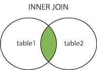

<details><summary>Learning Objectives</summary>
<br>

After completing this module, associates should be able to:

- Describe what is an `INNER JOIN`
- Write commands that makes use of `INNER JOIN`

</details>

<details><summary>Description</summary>
<br>

An `INNER JOIN` selects all rows from both tables as long as there is a match between the columns.  If there are data in the "Table1" table that do not have matches in "Table2", these orders will not be shown.





Syntax:   

SELECT column_name(s)  
FROM table1  
INNER JOIN table2  
ON table1.column_name = table2.column_name;

</details>

<details><summary>Real World Application</summary>

<br>

- `INNER JOIN` can be a faster way of gathering information between related tables when compared to subqueries. 
- `INNER JOIN` helps in selecting data that have matching values between two entities.

</details>

<details><summary>Implementation</summary> 

<br>

Table: Users 

| userid | username       | email                   |
| -------| ---------------| ----------------------- |
| 1    | LolipopMagee   | Sarah.Magee@example.com   |
| 2      | ToBeOrNotToBe  | harry.smith@example.com |
| 3      | JingleTrees    | bob.johnson@example.com |


Table: Account

| accountid | userid | accountnumber  | balance |
| --------- | ------ | ------------- | ---------|
| 101       | 1      | A123456       | 1000.00  |
| 102       | 2      | B789012       | 2500.50  |
| 103       | 3      | C345678       | 500.25   |


In this example, we have two tables: `Users` and `Account`.   
The `Users` table contains information about users, and the `Account` table contains information about their accounts.  
The `UserID` in the `Account` table is a foreign key referencing the `UserID` in the `Users` table, establishing a relationship between the two tables.  

Now, let's say you want to perform an INNER JOIN to get information about users and their corresponding accounts:  


```sql

-- INNER JOIN example  

SELECT Users.UserID, Users.UserName, Users.Email, Account.AccountNumber, Account.Balance  
FROM Users  
INNER JOIN Account ON Users.UserID = Account.UserID;  

```  


This query retrieves the `UserID`, `UserName`, `Email`, `AccountNumber`, and `Balance` for users who have accounts. The `INNER JOIN` is performed based on the matching `UserID` in both tables. 


**NOTE**: If you are following along be sure to use the table name **Users** NOT **User** or you will get an error as User is a keyword in SQL.   


**OUTPUT**:


| userid| username      | email                   | accountnumber | balance  |
| ----- | ------------- | ----------------------- | --------------| ---------|
| 1     | LolipopMagee  | Sarah.Magee@example.com | A123456       | 1000.00  |
| 2     | ToBeOrNotToBe | harry.smith@example.com | B789012       | 2500.50  |
| 3     | JingleTrees   | bob.johnson@example.com | C345678       | 500.25   |


We could have achieved the same result without a Join by doing the following query:


```sql

SELECT Users.UserID, Users.UserName, Users.Email, Account.AccountNumber, Account.Balance
FROM Users, Account
WHERE Users.UserID = Account.UserID;

```

OUTPUT:


| userid| username      | email                    | accountnumber | balance |
| ------| ------------- | -------------------------| --------------| --------|
| 1     | LolipopMagee  | Sarah.Magee@example.com  | A123456       | 1000.00 |
| 2     | ToBeOrNotToBe | harry.smith@example.com  | B789012       | 2500.50 |
| 3     | JingleTrees   | bob.johnson@example.com  | C345678       | 500.25  |


This implicitly creates a join condition in the WHERE clause, and the result will include only the rows where the `UserID` matches between the `User` and `Account` tables. However, it's generally recommended to use explicit JOIN syntax for better readability and maintainability of your queries.  


</details>

<details><summary>Summary</summary> 
<br>

* `INNER JOIN` restricts records retrieval from Table1 and Table2 to those that satisfy the join requirement.
* `INNER JOIN` is the most widely used form of JOIN and is very common within the SQL community. 

</details>

<details><summary>Practice Questions</summary>


[Practice Questions](./Quiz.gift)</details>