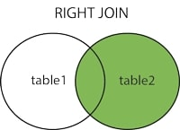

<details><summary>Learning Objectives</summary>
<br>

After completing this module, associates should be able to:

* Describe the use of `LEFT JOIN` and `RIGHT JOIN` in a database
* Differentiate when to use `LEFT JOIN` and `RIGHT JOIN`

</details>
<details><summary>Description</summary>
<br>

- `LEFT JOIN` returns all records from the left table, and the records that match the condition from the right table.


**Syntax**: 

SELECT column_name(s)  
FROM table1  
LEFT JOIN table2  
ON table1.column_name = table2.column_name;    

- `RIGHT JOIN` returns all records from the right table, and the records that match the condition from the left table.



**Syntax**: 

SELECT column_name(s)  
FROM table1  
RIGHT JOIN table2  
ON table1.column_name = table2.column_name;  

**NOTE**: `LEFT` and `RIGHT` tables do not actually exist in a database it simply means the table written first or second. 


* The table mentioned first in a `LEFT JOIN` (on the left side of the JOIN keyword) is considered the "left" table, and all its rows will be included in the result set, regardless of whether there are matching rows in the table mentioned second (on the right side of the JOIN keyword).
* In a `RIGHT JOIN`, the table mentioned second is the "right" table, and all its rows will be included in the result set, regardless of whether there are matching rows in the table mentioned first.  


</details>
<details><summary>Real World Application</summary>
<br>

Real world applications include:

* To query the hierarchical data and comparing records of official reports.
* Retrieve comprehensive data, especially when dealing with tables that may not have matching records in both directions.

</details>
<details><summary>Implementation</summary> 
<br>

Table: Customers 

|customerid|first_name|last_name|country|
----------|----------|---------|-------|
| 1|John      |Carpenter|USA    |
| 2|Jane      |Labumba  |Canada |
|3|Bob       |Johnson  |UK     |

Table: Orders

|orderid|customerid|orderdate |totalamount|
-------|----------|----------|-----------|
| 101|         1|2023-01-15|     500.00|
| 102|         2|2023-02-10|     750.25|
| 103|         1|2023-03-05|     200.50|
| 104|         4|2023-04-20|     300.75|

In this example, we have two tables: `Customers` and `Order`. The `Customers` table contains information about customers, and the `Order` table contains information about their orders. Please note that in the `Orders` table, the `CustomerID` column is a foreign key referencing the `CustomerID` column in the `Customers` table. This establishes a relationship between the two tables.


You want to see a list of all customers and their orders, even if some customers haven't placed any orders.

```sql
SELECT Customers.CustomerID, Customers.First_Name, Customers.Last_Name, Orders.OrderID
FROM Customers
LEFT JOIN Orders ON Customers.CustomerID = Orders.CustomerID;
```

SQL query performs a `LEFT JOIN `between the `Customers` and `Orders` tables based on the common column `CustomerID`. 

The result of this query will be a list of customers along with their associated orders (if any). If a customer has placed orders, the `OrderID` will be displayed. If a customer hasn't placed any orders, the corresponding columns from the `Orders` table will contain `NULL` values.

|customerid|first_name|last_name|orderid|
----------|----------|---------|-------|
| 1|John      |Carpenter|    101|
| 2|Jane      |Labumba  |    102|
| 1|John      |Carpenter|    103|
| 3|Bob       |Johnson  |     NULL  |

**NOTE**: John Carpenter had placed two orders so is listed twice. 

In this example we want to see all the orders and their corresponding customer information.

```sql
SELECT Customers.CustomerID, Customers.First_Name, Customers.Last_Name, Customers.Country, Orders.OrderID, Orders.OrderDate, Orders.TotalAmount
FROM Customers
RIGHT JOIN Orders ON Customers.CustomerID = Orders.CustomerID;
```

Here, a `RIGHT JOIN` is used to retrieve all orders and their corresponding customer information. The result will include all orders, and if an order has a corresponding customer, the customer information will be included. If there's an order without a matching customer, the columns related to customers will contain `NULL` values.

|customerid|first_name|last_name|country|orderid|orderdate |totalamount|
----------|----------|---------|-------|-------|----------|-----------|
| 1|John      |Carpenter|USA    |    101|2023-01-15|     500.00|
| 2|Jane      |Labumba  |Canada |    102|2023-02-10|     750.25|
| 1|John      |Carpenter|USA    |    103|2023-03-05|     200.50|
| NULL|    NULL      |  NULL       |  NULL     |    104|2023-04-20|     300.75|
</details>
<details><summary>Summary</summary> 
<br>

* `LEFT JOIN` allows us to get all the entries from Table1 and those records from Table2 that meet the join criteria.
  * If there is no match in Table2 for a record in Table1, the result will still include the record from Table1, but with `NULL` values for columns from Table2.
* `RIGHT JOIN` allows us to get all the entries from Table2 and those records from Table1 that meet the join criteria. 
  * If there is no match in Table1 for a record in Table2, the result will still include the record from Table2, but with `NULL` values for columns from Table1.

**Syntax LEFT JOIN**: 

SELECT column_name(s)  
FROM table1  
LEFT JOIN table2  
ON table1.column_name = table2.column_name;

**Syntax RIGHT JOIN**: 

SELECT column_name(s)  
FROM table1  
RIGHT JOIN table2  
ON table1.column_name = table2.column_name;

</details>
<details><summary>Practice Questions</summary>

[Practice Questions](./Quiz.gift)</details>
