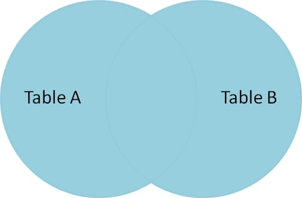

<details><summary>Learning Objectives</summary>
<br>

After completing this module, associates should be able to:
- Describe what is an `OUTER JOIN`
- Write commands that makes use of `OUTER JOIN`

</details>
<details><summary>Description</summary>
<br>

* An `OUTER JOIN`, yields non-matching records as well as matching records from both tables.
  * If rows in a connected table don't match, the `NULL` values will be shown.
* MySQL, does not support `OUTER JOIN` you must use a left `LEFT JOIN` or `RIGHT JOIN` to get the behaviors of a `OUTER JOIN`
* Some other dialects of SQL you can use a `FULL OUTER JOIN` or `FULL JOIN` to combine two tables data together.


</details>
<details><summary>Real World Application</summary>
<br>

- Used to fetch data from different tables 
- Handling Incomplete Data 
- Analyzing Discrepancies between datasets
- Combining Multiple Sources
- Aggregating Data

</details>
<details><summary>Implementation</summary> 
<br>

Table: PartyGuests

|guestid|guestname|
-------|---------|
| 1|Alice    |
| 2|Bob      |
| 3|Charlie  |
| 4|David    |

Table: PartyAttendees

|attendeeid|attendeename|
----------|------------|
| 1|Alice       |
| 3|Charlie     |
| 5|Eve         |

Let's consider a scenario where you have two tables: one containing a list of people invited to a party `PartyGuests` and another containing a list of people who actually attended the party `PartyAttendees`. We'll use a `FULL OUTER JOIN` to combine these tables and see the complete picture, including guests who didn't attend and attendees who were not on the original guest list.

```sql
SELECT PartyGuests.GuestID, PartyAttendees.AttendeeID, PartyGuests.GuestName,
    PartyAttendees.AttendeeName  
FROM PartyGuests  
FULL OUTER JOIN PartyAttendees ON PartyGuests.GuestID = PartyAttendees.AttendeeID;
```

This could also be written omitting OUTER and yield the same result.

```sql
SELECT PartyGuests.GuestID, PartyAttendees.AttendeeID, PartyGuests.GuestName,
    PartyAttendees.AttendeeName
FROM PartyGuests
FULL JOIN PartyAttendees ON PartyGuests.GuestID = PartyAttendees.AttendeeID;
```
OUTPUT:
|guestid|attendeeid|guestname|attendeename|
-------|----------|---------|------------|
| 1|         1|Alice    |Alice       |
| 2|        NULL  |Bob      |    NULL        |
| 3|         3|Charlie  |Charlie     |
| 4|      NULL    |David    |     NULL       |
| NULL|         5|   NULL      |Eve         |

This example demonstrates how a `FULL OUTER JOIN` helps you see the complete picture of guests and attendees at a party, including those who were on the guest list but didn't attend and those who attended but were not on the guest list.

</details>
<details><summary>Summary</summary> 
<br>

- `OUTER JOIN` also known as `FULL OUTER JOIN` returns all records from both tables whether the other table matches or not.
- `OUTER JOIN` is of two types: `LEFT JOIN` and `RIGHT JOIN`.
- You can use a `FULL OUTER JOIN` or `FULL JOIN` to combine two tables data together.

**Syntax**:  
SELECT column_name(s)  
FROM table1  
FULL OUTER JOIN table2  
ON table1.column_name = table2.column_name;


</details>
<details><summary>Practice Questions</summary>

[Practice Questions](./Quiz.gift)</details>
